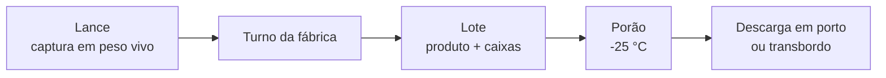
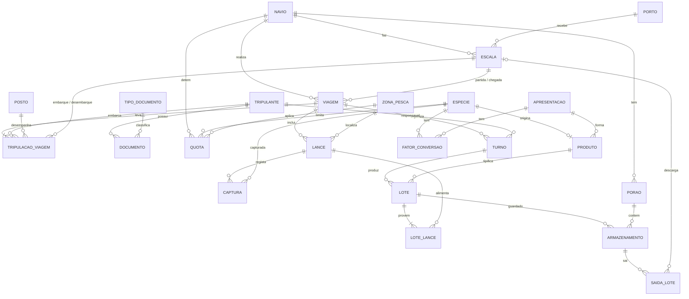

# Base de Dados de um Navio-Fábrica de Pesca

Base de dados relacional em **MySQL** para gerir a operação de um arrastão-fábrica que pesca bacalhau e camarão no Mar da Noruega e em Svalbard. Cobre o navio e as suas escalas, as viagens (marés) e a tripulação, a pesca lance a lance, as quotas, a transformação a bordo em lotes, o armazenamento nos porões e as descargas e transbordos.

Projeto da unidade curricular de **Modelação e Preparação de Dados** — ISCAC | Coimbra Business School, ano letivo 2026/2027.

---

## Índice

- [Contexto](#contexto)
- [Tecnologias](#tecnologias)
- [Estrutura do repositório](#estrutura-do-repositório)
- [Como executar](#como-executar)
- [Modelo de dados](#modelo-de-dados)
- [Regras de negócio](#regras-de-negócio)
- [Testes dos triggers](#testes-dos-triggers)
- [Dados de teste e RGPD](#dados-de-teste-e-rgpd)
- [Limitações e trabalho futuro](#limitações-e-trabalho-futuro)
- [Autores](#autores)

---

## Contexto

O modelo foi construído a partir de uma entrevista a um tripulante e de documentos reais de operação (lista de tripulação IMO e declaração de chegada SafeSeaNet à Noruega). O navio:

- faz marés de cerca de 6 semanas a partir de Tromsø, com cerca de 24 tripulantes;
- regista a pesca **lance a lance** num diário eletrónico (ERS), em **peso vivo**;
- pesca **bacalhau** (*Gadus morhua*) e **camarão-boreal** (*Pandalus borealis*) nas divisões ICES 2.a e 2.b (ZEE da Noruega e zona de Svalbard);
- processa, congela e embala o peixe a bordo: bacalhau sem cabeça e eviscerado (HEG) e camarão cru inteiro (WHL);
- troca de tripulação em cada nova viagem, mas alguns tripulantes ficam a bordo por opção.

O centro do modelo é o **lote de produção**: liga cada caixa congelada aos lances de onde o peixe veio, o que permite rastrear qualquer caixa até à zona e à data de captura.



## Tecnologias

| Ferramenta | Utilização |
| --- | --- |
| MySQL 8.4 | Sistema de gestão de base de dados |
| Docker / Docker Compose | Servidor MySQL local, igual para todo o grupo |
| DBeaver | Execução de scripts e consulta de dados |
| DbSchema | Diagramas do esquema relacional |

## Estrutura do repositório

```
.
├── docker-compose.yml        # Contentor MySQL 8.4
├── 01_schema.sql             # Criação das 23 tabelas, PK, FK, UNIQUE e CHECK
├── 01b_saida_porao.sql       # Migração (só para BD criadas antes de 05/10/2026)
├── 02_dados.sql              # Dados de teste fictícios de uma maré completa
├── 03_triggers.sql           # 7 triggers das regras de negócio
├── 04_testes_triggers.sql    # 18 testes automáticos aos triggers
├── modelo_final.dbs          # Projeto DbSchema (diagramas)
└── README.md
```

## Como executar

### 1. Arrancar o MySQL

Com o Docker Desktop aberto, na pasta do projeto:

```bash
docker compose up -d
docker compose logs -f mysql      # esperar por "ready for connections" e sair com Ctrl+C
```

| Parâmetro | Valor |
| --- | --- |
| Contentor | `MPD_pesca` |
| Host / porta | `localhost:3307` (ver `ports` no `docker-compose.yml`) |
| Base de dados | `sta_princesa` |
| Utilizador | `aluno` / `mysql` (ou `root` / `root`) |

> As passwords estão no `docker-compose.yml` por se tratar de um ambiente local de desenvolvimento. Não usar estas credenciais num servidor real.

### 2. Correr os scripts, por esta ordem

**Windows (PowerShell)** — o `cmd /c` garante que os acentos chegam bem ao MySQL:

```powershell
cmd /c "docker exec -i MPD_pesca mysql -uroot -proot --default-character-set=utf8mb4 --table < 01_schema.sql"
cmd /c "docker exec -i MPD_pesca mysql -uroot -proot --default-character-set=utf8mb4 --table < 02_dados.sql"
cmd /c "docker exec -i MPD_pesca mysql -uroot -proot --default-character-set=utf8mb4 --table < 03_triggers.sql"
cmd /c "docker exec -i MPD_pesca mysql -uroot -proot --default-character-set=utf8mb4 --table < 04_testes_triggers.sql"
```

**Linux / macOS:**

```bash
for f in 01_schema.sql 02_dados.sql 03_triggers.sql 04_testes_triggers.sql; do
  docker exec -i MPD_pesca mysql -uroot -proot --default-character-set=utf8mb4 --table < "$f"
done
```

Também se podem abrir no **DBeaver** e executar com **Alt+X** (executar script inteiro, não Ctrl+Enter). Os scripts 03 e 04 usam `DELIMITER`; se o DBeaver der erro nessa linha, usar o terminal.

### 3. Verificar

| Script | Resultado esperado no fim |
| --- | --- |
| `01_schema.sql` | `23` tabelas · `34` chaves estrangeiras |
| `02_dados.sql` | COD 42 200 kg · PRA 14 000 kg · stock a bordo dos lotes 4, 6 e 7 |
| `03_triggers.sql` | Lista dos 7 triggers |
| `04_testes_triggers.sql` | 18 testes, todos com resultado `OK` |

Todos os scripts podem ser corridos mais do que uma vez: o 01 apaga e recria as tabelas, o 02 esvazia-as antes de inserir, o 03 apaga os triggers antes de os criar e o 04 desfaz as alterações no fim.

## Modelo de dados

**23 tabelas · 34 chaves estrangeiras**, em quatro áreas:

| Área | Tabelas |
| --- | --- |
| Operação e tripulação | `navio`, `porto`, `escala`, `viagem`, `tripulante`, `posto`, `tripulacao_viagem`, `documento`, `tipo_documento` |
| Pesca e quotas | `especie`, `zona_pesca`, `lance`, `captura`, `quota` |
| Fábrica | `apresentacao`, `produto`, `fator_conversao`, `turno`, `lote`, `lote_lance` |
| Porões e saídas | `porao`, `armazenamento`, `saida_lote` |



Algumas decisões de modelação:

- **Códigos naturais como chave** nas tabelas de referência: FAO (`COD`, `PRA`), apresentação (`HEG`, `WHL`) e UN/LOCODE dos portos (`NOTOS` = Tromsø).
- **Datas e horas em UTC.** A escala guarda as horas previstas (ETA/ETD) e reais (ATA/ATD).
- **Uma viagem começa e acaba numa escala.** A escala de chegada fica `NULL` enquanto o navio está no mar.
- **Tripulação por viagem** (`tripulacao_viagem`): o posto é guardado por viagem, porque um tripulante pode mudar de posto entre marés. `id_escala_desembarque` a `NULL` indica que fica a bordo.
- **Captura em peso vivo**, como no diário ERS. O fator de conversão serve para verificar a produção da fábrica (peso do produto × fator ≈ peso vivo).
- **Lote ↔ lance é N:M:** um lote junta peixe de vários lances e um lance pode dar vários lotes.
- **A saída aponta para o armazenamento** (FK composta `(id_lote, id_porao)`), o que garante que só sai de um porão o que lá esteve guardado.
- **Pesos em `DECIMAL`**, nunca `FLOAT`, para as somas das quotas serem exatas.

## Regras de negócio

| Regra | Descrição | Implementação |
| --- | --- | --- |
| RN2 | O IMO identifica o navio e é único | `UNIQUE (imo)` |
| RN3 | Viagens numeradas por navio | `UNIQUE (id_navio, num_viagem)` |
| RN10 | Um único comandante por viagem | Trigger `trg_tripulacao_comandante` |
| RN16 | Um lote só usa peixe da sua viagem e espécie, sem exceder o capturado | Trigger `trg_lote_lance_viagem` |
| RN19 | Capturas não podem exceder a quota (navio, espécie, zona, ano) | Trigger `trg_captura_quota` |
| RN22 | Um porão não pode exceder a capacidade (entradas − saídas) | Trigger `trg_armazenamento_capacidade` |
| RN24 | Não sai mais stock de um porão do que o que lá está | Trigger `trg_saida_stock` |
| — | Não se guardam mais caixas do que as produzidas pelo lote | Trigger `trg_armazenamento_lote` |
| RN25 | Uma saída é descarga em porto **ou** transbordo, nunca as duas | `CHECK` com XOR + FK composta |
| RN26 | Peso do produto ≤ peso da matéria-prima | `CHECK` |
| RN28 | O responsável do turno é Factory Manager ou 2nd Factory Manager | Trigger `trg_turno_responsavel` |
| RN30 | Uma só apresentação por espécie neste navio | `UNIQUE (cod_fao)` em `produto` |

Os triggers são `BEFORE INSERT` e recusam operações inválidas com `SIGNAL SQLSTATE '45000'` e uma mensagem que explica o problema, por exemplo:

```
RN19: quota excedida (COD): restam 381700.00 kg, pedido 390000.00 kg
```

## Testes dos triggers

O `04_testes_triggers.sql` cria o procedimento `sp_testar_triggers()`, que tenta 18 inserções (casos válidos e inválidos para cada trigger) e mostra, para cada uma, o resultado esperado, o obtido e a mensagem do trigger. Tudo corre dentro de uma transação desfeita no fim (`ROLLBACK`), por isso os dados não são alterados.

Resultado atual: **18/18 OK**.

## Dados de teste e RGPD

O `02_dados.sql` contém uma maré completa (Trip 11, de 12/07 a 24/08/2026) e o início da seguinte (Trip 12, ainda no mar): 14 tripulantes, 8 lances nas três zonas, 4 quotas, 7 turnos, 7 lotes, armazenamento em dois porões, um transbordo e uma descarga em Tromsø.

**Todos os dados são fictícios** — nomes, documentos, IMO, MMSI e quantidades. Os documentos reais usados no levantamento de requisitos contêm dados pessoais da tripulação (nomes, datas de nascimento, passaportes) e **não fazem parte deste repositório**.

Valores de exemplo a confirmar com o armador: peso por caixa (25 kg bacalhau, 20 kg camarão) e fator de conversão do bacalhau HEG (1,50).

## Limitações e trabalho futuro

- Os triggers cobrem só `INSERT`; um `UPDATE` às quantidades pode contornar as regras. Solução: repetir a lógica em triggers `BEFORE UPDATE`.
- Ficaram fora do âmbito: combustível, resíduos MARPOL, provisões, equipamentos da fábrica, registo de temperatura dos porões e congelação dos lotes.
- Triggers opcionais por implementar: numeração automática de viagens e lances, e validação das datas dos lances face às da viagem.
- Consultas de análise para a defesa (rendimento, quota consumida, rastreabilidade de uma caixa) — `05_consultas.sql`, em preparação.


Unidade curricular de Modelação e Preparação de Dados · ISCAC | Coimbra Business School · 2026/2027
